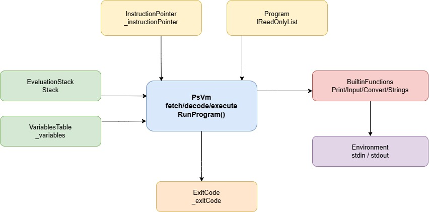

# Спецификация виртуальной машины

Виртуальная машина (VM) является стековой: все вычисления выполняются через стек значений (`EvaluationStack`), без регистров общего назначения.  
Компилятор (`PsVmCodegen`) генерирует линейный байткод (`List<Instruction>`), который исполняется классом `PsVm`.

## Иллюстрация 

Иллюстрация структуры виртуальной машины:

## Компоненты VM

- `PsVm` — исполнительный цикл `fetch/decode/execute`.
- `Program` (`IReadOnlyList<Instruction>`) — последовательность байткода.
- `InstructionPointer` (`_instructionPointer`) — индекс текущей инструкции.
- `EvaluationStack` (`Stack<Value>`) — стек операндов и промежуточных результатов.
- `VariablesTable` (`_variables`) — цепочка таблиц переменных (текущая + `Parent`) для лексических областей видимости.
- `BuiltinFunctions` — реализация встроенных функций.
- `Environment` — внешний ввод-вывод.
- `CallStack` (`_callStack`) — стек целых (`Stack<int>`), в котором хранятся **возвратные адреса** для инструкции `Call`: после стандартного увеличения `InstructionPointer` в цикле исполнения в стек кладётся индекс следующей инструкции после `Call`; при `Return` адрес снимается и подставляется в `InstructionPointer` (см. п. 5).
- `ExitCode` (`_exitCode`) — код завершения, возвращаемый `RunProgram()`.

## Цикл выполнения

1. Взять `instruction = Program[InstructionPointer]`.
2. Увеличить `InstructionPointer`.
3. Выполнить действие согласно `instruction.Code`.
4. Продолжать до `Halt`.

Проверки перед запуском:

- программа не пуста;
- в списке инструкций есть **хотя бы одна** `Halt`; проверяется только **наличие** такой инструкции в `Program`, а не то, что она последняя. После изменения кодогенерации при поддержке пользовательских функций (`Call`/`Return`) и общем линейном списке инструкций `Halt` может располагаться не в конце программы.

## Формат инструкций и значения

Инструкция содержит:

- `Code: InstructionCode`;
- `Operand: Value` (присутствует всегда; если операнд не нужен, используется `Value.Unit`).

Поддерживаемые типы `Value`:

- `int` (`long`);
- `float` (`double`);
- `str` (`string`);
- `bool` (`bool`);
- `unit`.

## Набор реализованных инструкций

Обозначения:

- `EVAL[^1]` — вершина стека;
- `EVAL[^2]` — элемент под вершиной.

## Инструкции VM

### 1) Стек и переменные

1. `Push [Value]` — кладет значение в стек.
2. `Pop` — снимает и отбрасывает вершину стека.
3. `DefineLocal [Name]` — снимает значение со стека и объявляет новую переменную в текущей таблице.
4. `LoadLocal [Name]` — загружает значение переменной в стек.
5. `StoreLocal [Name]` — снимает значение и присваивает его уже существующей переменной (поиск идет по цепочке таблиц).
6. `PushVars` — создает новую таблицу переменных (`VariablesTable`) поверх текущей.
7. `PopVars` — удаляет текущую таблицу переменных и возвращается к родительской.

### 2) Арифметика

8. `Add` — `left + right`.
9. `Subtract` — `left - right`.
10. `Multiply` — `left * right`.
11. `Divide` — `left / right` (`int/int` дает целочисленный результат, иначе `float`).
12. `Modulo` — `left % right` (для `int` и `float`).
13. `Power` — `pow(left, right)` (`Math.Pow`).
14. `Negate` — унарный минус.

Правило бинарной числовой операции: если хотя бы один операнд `float`, результат `float`; иначе `int`.

### 3) Логика и сравнения (итерация №4)

15. `Not` — логическое отрицание `!operand`.
16. `And` — логическое `left && right`.
17. `Or` — логическое `left || right`.
18. `Less` — сравнение `<`.
19. `LessOrEqual` — сравнение `<=`.
20. `Equal` — сравнение `==`.
21. `NotEqual` — сравнение `!=`.

Операторы `>` и `>=` в байткоде генерируются через перестановку операндов и инструкции `Less`/`LessOrEqual`.

Короткое замыкание:

- для `&&` и `||` кодогенерация использует ветвления (`JumpIfFalse`, `JumpIfTrue`) и базовые блоки;
- инструкции `And`/`Or` в VM также реализованы и могут использоваться как прямые логические операции.

### 4) Переходы и ветвления if/else (итерация №4)

22. `Jump [Address]` — безусловный переход.
23. `JumpIfTrue [Address]` — снимает `bool`-условие; переходит при `true`.
24. `JumpIfFalse [Address]` — снимает `bool`-условие; переходит при `false`.

Кодогенерация `if/else`:

- условие вычисляется и кладется в стек;
- генерируется условный переход в `else`/`final` блок;
- затем `then`-ветка;
- затем переход в `final`;
- затем `else`-ветка (если есть);
- продолжение в `final` блоке.

### 5) Вызовы пользовательских функций (итерация №5)

Добавлены инструкции **`Call`** и **`Return`**; для них в состоянии VM используется **`_callStack`** (см. раздел «Компоненты VM»).

25. `Call [Address]` — вызов функции по абсолютному индексу инструкции `Address` в `Program`. После стандартного шага цикла (чтение инструкции и увеличение `InstructionPointer`) VM: сохраняет текущий `InstructionPointer` в `_callStack` как адрес возврата; создаёт новую таблицу переменных поверх текущей (`VariablesTable` с `Parent`); устанавливает `InstructionPointer = Address`.

26. `Return` — возврат из вызванной подпрограммы: снимает `EVAL[^1]` как возвращаемое значение; снимает текущую таблицу переменных (возврат к `Parent`); восстанавливает `InstructionPointer` из вершины `_callStack`; кладёт возвращаемое значение обратно в `EvaluationStack`.

Инструкция `Call` создаёт новую таблицу переменных для тела вызываемой функции; `Return` восстанавливает таблицу вызывающего контекста и адрес возврата из `_callStack`.

### 6) Встроенные функции

27. `CallBuiltin [Code]` — вызывает встроенную функцию по `BuiltinFunctionCode`.

Поддерживаемые коды встроенных функций:

- `Print`, `PrintI`, `PrintF`, `PrintB`;
- `Input`;
- `ItoS`, `FtoS`, `ItoF`, `FtoI`, `StoI`, `StoF`;
- `SConcat`, `SubStr`, `StrLen`.

### 7) Завершение

28. `Halt` — останавливает VM, снимает `EVAL[^1]` как `ExitCode` (`int`) и возвращает его из `RunProgram()`.