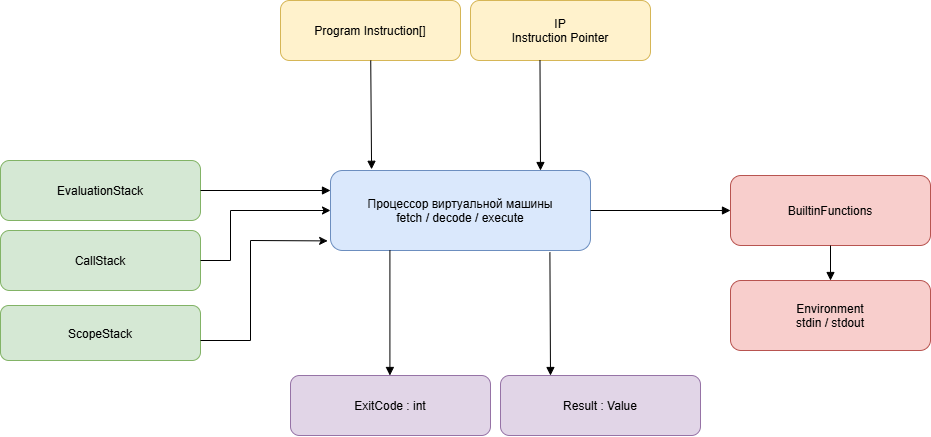

# Спецификация виртуальной машины

Виртуальная машина (VM) является **стековой**: все операнды передаются через стек значений, а не через регистры. Программа компилируется в последовательность байт-кодовых инструкций.
Исполнительное ядро декодирует и выполняет инструкции по одной за раз.

## Иллюстрация

Иллюстрация структуры виртуальной машины:

## Структура виртуальной машины

### Центральный компонент

**Процессор виртуальной машины (fetch / decode / execute)**  
Основной исполнительный модуль, который:
- извлекает инструкции из программы,
- декодирует их,
- выполняет операции над состоянием виртуальной машины.

### Основные входные данные

- **Список инструкций (Program Instruction[])** — программа в виде байт-кода.
- **IP (Instruction Pointer)** — указатель на текущую инструкцию.

### Стековые структуры

- **EvaluationStack** — стек вычислений и передачи значений.
- **CallStack** — стек вызовов функций.
- **ScopeStack** — стек областей видимости переменных.

### Подсистемы

- **BuiltinFunctions** — встроенные функции (print, input, преобразования типов и т.д.).
- **Environment (stdin/stdout)** — взаимодействие с внешней средой.

### Результат выполнения

- **Result : Value** — итоговое значение программы.
- **ExitCode : int** — код завершения выполнения.

## Модель виртуальной машины

Состояние VM состоит из следующих компонентов:

1. `Program` — массив инструкций `Instruction[]`.
2. `IP` (`Instruction Pointer`) — индекс выполняемой инструкции.
3. `EvaluationStack` — стек значений для вычислений и передачи аргументов.
4. `CallStack` — стек кадров вызова функций.
5. `ScopeStack` — стек таблиц переменных для вложенных областей видимости.
6. `BuiltinFunctions` — модуль встроенных функций.
7. `Environment` (`stdin/stdout`) — внешний ввод/вывод.
8. `Result` — результат программы (произвольный `Value`).
9. `ExitCode` — код завершения (`int`).

### Кадр вызова (`CallFrame`)

Каждый кадр в `CallStack` хранит:

- `returnIp` — адрес инструкции, на которую нужно вернуться после `Return`;
- `scopeBaseDepth` — глубину `ScopeStack` на момент входа в функцию (для корректного снятия локальных областей функции);
- `functionName` (опционально, для диагностики).

### Таблица переменных (`Scope`)

Каждая область видимости содержит:

- словарь `name -> Value`;
- ссылку на родительскую область (логически через предыдущий элемент в `ScopeStack`).

Поиск переменной выполняется от текущей области к родительским.

## Цикл выполнения

1. Взять инструкцию `Program[IP]`.
2. Инкрементировать `IP`.
3. Выполнить инструкцию.
4. Продолжать до `Halt`.

### Гарантии запуска

- программа не пустая;
- адреса переходов и вызовов функций валидны;
- последняя инструкция — `Halt`.

## Формат инструкции

Инструкция содержит:

- `Code` — код операции;
- `Operand` — операнд (опционален).

Обозначения:

- `EVAL[^1]` — вершина `EvaluationStack`;
- `EVAL[^2]` — элемент под вершиной;
- операнд указывается как `[Operand]`.
- аргументы функций передаются через стек: `EVAL[^1]` — последний из `N` аргументов, `EVAL[^N]` — первый аргумент.

### Представление значений

Каждое значение (`Value`) содержит тип (`int`, `float`, `bool`, `str`, `unit`) и соответствующие данные.

Все операции виртуальной машины выполняют проверку типов во время выполнения.
Несовместимые операции приводят к ошибке выполнения.

## Набор инструкций

### Стек и переменные

1. `Push [Value]`  
   Помещает `[Value]` в `EvaluationStack`.

2. `Pop`  
   Удаляет `EVAL[^1]`.

3. `Duplicate`  
   Дублирует `EVAL[^1]`.

4. `LoadVar [Name]`  
   Ищет переменную `[Name]` в `ScopeStack` (от текущей области к родительским), найденное значение кладет в стек.

5. `DefineVar [Name]`  
   Создает переменную `[Name]` в текущей области и присваивает ей `EVAL[^1]` (значение снимается со стека).

6. `StoreVar [Name]`  
   Ищет уже существующую переменную `[Name]` и записывает в нее `EVAL[^1]` (значение снимается со стека).  
   Если переменная не найдена, выбрасывается ошибка выполнения.

7. `PushScope`  
   Создает новую локальную область видимости (вход в `{ ... }`).

8. `PopScope`  
   Удаляет текущую область видимости (выход из `{ ... }`).

### Арифметика и логика

9. `Add` — `EVAL[^2] + EVAL[^1]`.
10. `Subtract` — `EVAL[^2] - EVAL[^1]`.
11. `Multiply` — `EVAL[^2] * EVAL[^1]`.
12. `Divide` — `EVAL[^2] / EVAL[^1]`.
13. `Modulo` — `EVAL[^2] % EVAL[^1]`.
14. `Power` — `pow(EVAL[^2], EVAL[^1])`.
15. `Negate` — `-EVAL[^1]`.
16. `And` — логическое `AND`.
17. `Or` — логическое `OR`.
18. `Not` — логическое отрицание `!EVAL[^1]`.
19. `Equal` — сравнение на равенство.
20. `NotEqual` — сравнение на неравенство.
21. `Less` — сравнение `<`.
22. `LessOrEqual` — сравнение `<=`.
23. `Greater` — сравнение `>`.
24. `GreaterOrEqual` — сравнение `>=`.

Для бинарных операций снимаются два значения и кладется результат.  
Для унарных операций снимается одно значение и кладется результат.

### Управление потоком

25. `Jump [Target]`  
   - устанавливает `IP` = `Target`

26. `JumpIfTrue [Target]`  
   - снимает значение со стека
   - если `true` -> `IP` = `Target`

27. `JumpIfFalse [Target]`  
    — снимает значение со стека
    — если `false` -> `IP` = `Target`
### Вызовы функций

28. `CallBuiltin [Code]`  
   Вызывает встроенную функцию по коду.  
   Аргументы передаются через `EvaluationStack` (`EVAL[^1]` — последний аргумент, `EVAL[^N]` — первый).  
   Если функция возвращает значение, это значение помещается в `EvaluationStack`.

29. `Call [Target]`  
   Вызов пользовательской функции:
   - в `CallStack` помещается новый `CallFrame(returnIp = IP, scopeBaseDepth = currentScopeDepth)`;
   - `IP = Target`;
   - создается новая область видимости функции (`PushScope`).

30. `Return`  
   Возврат из функции:
   - извлекается верхний `CallFrame`;
   - удаляются все области видимости, созданные внутри функции (до `scopeBaseDepth`);
   - `IP` восстанавливается в `returnIp`;
   - возвращаемое значение (если есть) остается на `EvaluationStack`.

### Завершение программы

31. `StoreResult`  
   Снимает `EVAL[^1]` и сохраняет в `Result` как логический результат выполнения программы.

32. `Halt`  
   Останавливает выполнение VM.  
   Снимает `EVAL[^1]` и использует его как `ExitCode` (код завершения процесса).

## Встроенные функции (`CallBuiltin`)

- `Print(s)`, `PrintI(i)`, `PrintF(value, precision)`;
- `Input()`;
- `ItoS`, `FtoS`, `ItoF`, `FtoI`, `StoI`, `StoF`;
- `SConcat`, `SubStr`, `StrLen`.

## Соответствие конструкциям языка

- `fn` реализуется через `Call`/`Return` и `CallStack`.
- `return` реализуется через `Return` (значение остается на `EvaluationStack`).
- `{ ... }` реализуются через `PushScope`/`PopScope`.
- `if/else` и `while` реализуются через `JumpIfFalse`/`Jump` и адреса меток.
