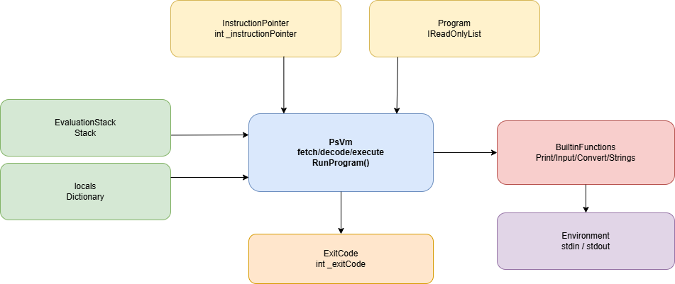

# Спецификация виртуальной машины

Виртуальная машина (VM) является **стековой**: все операнды передаются через стек значений, а не через регистры. 
Программа компилируется в последовательность байт-кодовых инструкций.

## Иллюстрация

Иллюстрация структуры виртуальной машины:

## Структура текущей VM

- `PsVm` — исполнительный цикл `fetch/decode/execute`.
- `Program` (`IReadOnlyList<Instruction>`) — массив инструкций байткода.
- `InstructionPointer` (`_instructionPointer`) — индекс текущей инструкции.
- `EvaluationStack` (`Stack<Value>`) — стек значений.
- `locals` (`Dictionary<string, Value>`) — таблица локальных переменных по имени.
- `BuiltinFunctions` — реализация встроенных функций (`print`, `input`, преобразования, строковые операции).
- `Environment` (`stdin/stdout`) — внешний ввод-вывод.
- `ExitCode` (`_exitCode`) — код завершения, который возвращает `RunProgram`.

## Цикл выполнения

1. Взять `instruction = Program[InstructionPointer]`.
2. Увеличить `InstructionPointer`.
3. Выполнить действие по `instruction.Code`.
4. Повторять, пока не встретится `Halt`.

Проверки перед запуском:

- программа не пустая;
- последняя инструкция — `Halt`.

## Формат и значения

Инструкция содержит:

- `Code: InstructionCode`;
- `Operand: Value` (поле есть всегда; для инструкций без операнда содержит `Value.Unit`).

Типы `Value`, используемые VM на текущем этапе:

- `int` (`long`);
- `float` (`double`);
- `str` (`string`);
- `unit`.

## Набор реализованных инструкций

Обозначения:

- `EVAL[^1]` — вершина стека;
- `EVAL[^2]` — элемент под вершиной.

### Стек и переменные

1. `Push [Value]`  
   Помещает `[Value]` в `EvaluationStack`.

2. `Pop`  
   Снимает `EVAL[^1]` и отбрасывает его.

3. `LoadLocal [Name]`  
   Читает переменную `locals[Name]` и кладет значение в стек.  
   Если переменная отсутствует, выбрасывается ошибка выполнения.

4. `StoreLocal [Name]`  
   Снимает `EVAL[^1]` и записывает его в `locals[Name]`.  
   Если имени еще нет в словаре, оно создается.

### Арифметика

5. `Add`  
   Снимает два операнда (`left = EVAL[^2]`, `right = EVAL[^1]`), кладет `left + right`.

6. `Subtract`  
   Снимает два операнда, кладет `left - right`.

7. `Multiply`  
   Снимает два операнда, кладет `left * right`.

8. `Divide`  
   Снимает два операнда, кладет `left / right`.  
   Если оба операнда `int`, выполняется целочисленное деление (`long / long`); если хотя бы один операнд `float`, результат вещественный.

9. `Power`  
   Снимает два операнда, кладет `pow(left, right)`.

10. `Modulo`  
    Снимает два операнда, кладет `left % right`.

11. `Negate`  
    Снимает один операнд, кладет `-operand`.

Правило для числовых бинарных операций: если хотя бы один операнд `float`, результат `float`; иначе результат `int`.

### Встроенные функции

12. `CallBuiltin [Code]`  
    Вызывает встроенную функцию по коду `BuiltinFunctionCode`.  
    Аргументы снимаются со стека в ожидаемом порядке конкретной функции.  
    Если функция возвращает значение, оно помещается в `EvaluationStack`.

Поддерживаемые коды встроенных функций:

- `Print`, `PrintI`, `PrintF`;
- `Input`;
- `ItoS`, `FtoS`, `ItoF`, `FtoI`, `StoI`, `StoF`;
- `SConcat`, `SubStr`, `StrLen`.

### Завершение выполнения

13. `Halt`  
    Останавливает VM.  
    Снимает `EVAL[^1]` и использует его как `ExitCode` (целое число), которое возвращает `RunProgram`.
